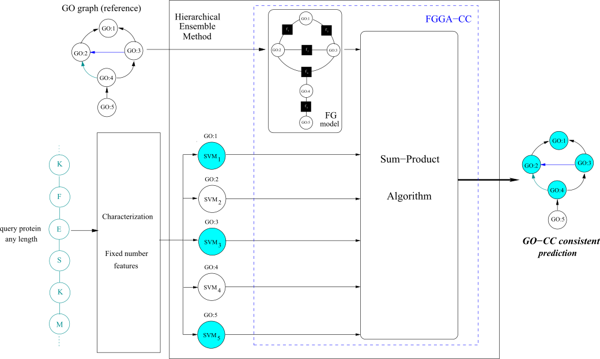

```{css, echo = FALSE, eval = TRUE}
.whiteCode {
    background-color: white;
    border-color: #337ab7 !important;
    border: 1px solid;
}
```

```{r settings, include = FALSE}
#library(knitr)
#opts_chunk$set(warning=TRUE, message = FALSE, cache = FALSE, tidy = FALSE, tidy.opts = list(width.cutoff = 60))
options(width = 100)
knitr::opts_chunk$set(collapse = TRUE, comment = "#>",class.source = "whiteCode")
```

# Automated Gene Ontology (GO) annotation methods

As volume of genomic data grows, computational methods become essential for providing a first glimpse onto gene annotations. Automated Gene Ontology (GO) annotation methods based on hierarchical ensemble classification techniques are particularly interesting when interpretability of annotation results is a main concern. In these methods, raw GO-term predictions computed by base binary classifiers are leveraged by checking the consistency of predefined GO relationships. FGGA is a factor graph approach to the hierarchical ensemble formulation of the automated GO annotation problem. In this formal method, a core factor graph is first built based on the GO structure and then enriched to take into account the noisy nature of GO-term predictions. Hence, starting from raw GO-term predictions, an iterative message passing algorithm between nodes of the factor graph is used to compute marginal probabilities of target GO-terms.

The method is detailed in the original [publications](#references) [1, 2], but this brief **vignette** explains how to use **FGGA** to predict a set of GO-terms (GO node labels) from gene-product sequences of a given organism. The aim is to improve the quality of existing electronic annotations and provide a new annotation for those unknown sequences that can not be classified by traditional methods such as Blast.

Thus, **FGGA** is a tool to the automated annotation of protein sequences, however, the annotation of other types of striking functional gene products is also possible, e.g., long non-coding RNAs. FGGA may bring an opportunity for improving the annotation of long non-coding RNA sequences through boosting the confidence of base binary classifiers by the characterization of their structures primary, secondary and tertiary. Along the vignette, we used protein coding genes data from Cannis familiaris organism obtained with [UniProt](https://www.uniprot.org/uniprot/?query=taxonomy:9615).



# Installation

The **fgga** R source package can be downloaded from [**Bioconductor repository**](https://bioconductor.org/) or [**GitHub repository**](https://github.com/fspetale/fgga). This R package contains a experimental dataset as example, one pre-run R object and all functions needed to run FGGA.

```{r, message = FALSE, eval = FALSE}
## From Bioconductor repository
if (!requireNamespace("BiocManager", quietly = TRUE)) {
        install.packages("BiocManager")
    }
BiocManager::install("fgga")

## Or from GitHub repository using devtools
BiocManager::install("devtools")
devtools::install_github("fspetale/fgga")
```

After the package is installed, it can be loaded into R workspace by

```{r setup, eval = TRUE, message=FALSE}
library(fgga)
```

# Input data

At present, the method directly supports data characterized from gene product sequences. This characterization can be generated according to the expert's criteria. For example, possible characterizations can be: [PFAM motifs](https://pfam.xfam.org/), [physico-chemical properties](https://web.expasy.org/protparam/), [signal peptides](http://www.cbs.dtu.dk/services/), among others. The admitted values can be of the numeric, boolean or character type. However, for greater efficiency of the binary classification algorithm it is recommended that the use of normalized numerical values. These datasets must have at least 50 annotations per GO-term to train the FGGA model.

# An example of the usage of FGGA for the automated GO annotation

In this section, we apply **FGGA** to predict the biological functions, GO-terms, of *Canis lupus familiaris* proteins. We download 6962 *Canis lupus familiaris*, Cf, protein sequences with their GO annotations from [UniProt](https://www.uniprot.org/uniprot/?query=taxonomy:9615) and then were characterized through physico-chemical properties from R package [Peptides](https://cran.r-project.org/web/packages/Peptides).

## Data Loading

Let us import the toy dataset in the workspace:

```{r, message = FALSE, eval = TRUE}
# Loading Canis lupus familiaris dataset and example R objects
data(CfData)

```

```{r, message = FALSE, eval = TRUE}
# To see the summarized experiment object
summary(CfData)

# To see the information of characterized data
dim(CfData$dxCf)

colnames(CfData$dxCf)[1:20]

rownames(CfData$dxCf)[1:10]

head.matrix(CfData$dxCf[, 51:61], n = 10)

# to see the information of GO data
dim(CfData$tableCfGO)

colnames(CfData$tableCfGO)[1:10]

rownames(CfData$tableCfGO)[1:10]

head(CfData$tableCfGO)[, 1:8]
```

*tableCfGO* is a binary matrix whose $(i, j)_{th}$ component is 1 if protein $i$ is annotated with $GO-term_j$, 0 otherwise. Note that the row names of both dxCf and tableCfGO are identical. Our binary classifiers require at least 50 annotations per GO-terms. Therefore, this condition is checked and those GO-terms that do not comply are eliminated.

```{r, message = FALSE, eval = TRUE}
# Checking the amount of annotations by GO-term

apply(CfData$tableCfGO, MARGIN=2, sum)
```

## GO subgraph building

If we want to predict GO-terms in a single subdomain, *BP, MF or CC* , we must build the GO-DAG associated with these GO-terms.

```{r, message = FALSE, eval = TRUE}
library(GO.db)
library(GOstats)

mygraph <- GOGraph(CfData$nodesGO, GOMFPARENTS)

# Delete root node called all
mygraph <- subGraph(CfData$nodesGO, mygraph)

# We adapt the graph to the format used by FGGA
mygraph <- t(as(mygraph, "matrix"))
mygraphGO <- as(mygraph, "graphNEL")

# We search the root GO-term
rootGO <- leaves(mygraphGO, "in")

rootGO

plot(mygraphGO)
```

On the other hand, if you want to predict in two or three subdomains you should use the preCoreFG function. This function builds a graph respecting the GO constraints of inference and also links the GO-terms of the selected subdomains.

```{r, message = FALSE, eval = FALSE}
# We add GO-terms corresponding to Cellular Component subdomain
myGOs <- c(CfData[['nodesGO']], "GO:1902494", "GO:0032991", "GO:1990234", 
            "GO:0005575")

# We build a graph respecting the GO constraints of inference to MF, CC and BP subdomains
mygraphGO <- preCoreFG(myGOs, domains="GOMF")

plot(mygraphGO)
```


## Matching a GO-DAG to a Factor Graph

Let's a GO subgraph, GO-terms [*GO:i*](GO:i){.uri} are mapped to binary-valued variable nodes $x_i$ of a factor graph while relationships between GO-terms are mapped to logical factor nodes $f_k$ describing valid [*GO:i*](GO:i){.uri} configurations under the True Path Graph constraint.

```{r message=FALSE, include=FALSE, results='hide'}
mygraphGO <- as(CfData[["graphCfGO"]], "graphNEL")

rootGO <- leaves(mygraphGO, "in")
```

```{r, message = FALSE, eval = TRUE}
modelFGGA <- fgga2bipartite(mygraphGO)
```

## Flat prediction with FGGA clasiffier

Now, let's use the MF subgraph to build our model of binary SVM classifiers with a training set of the Cf data.

```{r, message = FALSE, eval = TRUE}
# We take a subset of Cf data to train our model
idsTrain <- CfData$indexGO[["indexTrain"]][1:750]

# We build our model of binary SVM classifiers
modelSVMs <- lapply(CfData[["nodesGO"]], FUN = svmTrain, 
                    tableOntoTerms = CfData[["tableCfGO"]][idsTrain, ], 
                    dxCharacterized = CfData[["dxCf"]][idsTrain, ], 
                    graphOnto = mygraphGO, kernelSVM = "radial")
```

```{r, message = FALSE, eval = FALSE}
# We calculate the reliability of each GO-term
varianceGOs <- varianceOnto(tableOntoTerms = CfData[["tableCfGO"]][idsTrain, ], 
                        dxCharacterized = CfData[["dxCf"]][idsTrain, ], 
                        kFold = 5, graphOnto = mygraphGO, rootNode = rootGO, 
                        kernelSVM = "radial")

varianceGOs
```

```{r echo=FALSE, message=FALSE}
CfData[["varianceGOs"]]

varianceGOs <- CfData[["varianceGOs"]]
```

Next, we predict each GO-terms from a test set using our model of binary SVM classifiers.

```{r, message = FALSE, eval = TRUE}

dxTestCharacterized <- CfData[["dxCf"]][CfData$indexGO[["indexTest"]][1:50], ]

matrixGOTest <- svmOnto(svmMoldel = modelSVMs, 
                    dxCharacterized = dxTestCharacterized, 
                    rootNode = rootGO, 
                    varianceSVM = varianceGOs)

head(matrixGOTest)[,1:8]
```

## Compute marginal probabilities of GO-terms by each protein

Once a factor graph model *FG* for the automated GO annotation problem has been defined, an iterative message passing algorithm between nodes of *FG* can be used to compute maximum a posteriori (MAP) estimates of variable nodes $x_i$ modeling actual [*GO:i*](GO:i){.uri} annotations.

The function *msgFGGA* returns a matrix with *k* rows and *m* columns corresponding to the Cf proteins and MF GO-terms respectively.

```{r message = FALSE, eval = TRUE}
matrixFGGATest <- t(apply(matrixGOTest, MARGIN = 1, FUN = msgFGGA, 
                        matrixFGGA = modelFGGA, graphOnto = mygraphGO,
                        tmax = 50, epsilon = 0.001))

head(matrixFGGATest)[,1:8]
```

# FGGA Performance

We now evaluate the performance of **FGGA** in terms of hierarchical F-score. The hierarchical classification performance metrics like the hierarchical precision (HP), the hierarchical recall (HR), and the hierarchical F-score (HF) measures [publications](#references) [3] properly recognize partially correct classifications and correspondingly penalize more distant or more superficial errors. The formulas of the hierarchical metrics are shown below:

$$ 
HP(s) = \frac{1}{\mid l(P_{G}(s)) \mid} \hspace{1.25mm} \sum_{q \hspace{0.5mm} \in \hspace{0.5mm} l(P_{G}(s))} \hspace{1.5mm} \max_{c \hspace{0.5mm} \in \hspace{0.5mm} l(C_{G}(s))}  \frac{\mid \uparrow c \hspace{1mm} \cap \uparrow q \mid}{\uparrow q} 
$$

$$ HR(s) = \frac{1}{\mid l(C_{G}(s)) \mid} \hspace{1.25mm} \sum_{c \hspace{0.5mm} \in \hspace{0.5mm} (C_{G}(s))} \hspace{1.5mm} \max_{q \hspace{0.5mm} \in \hspace{0.5mm} l(P_{G}(s))}  \frac{\mid \uparrow c \hspace{1mm} \cap \uparrow q \mid}{\uparrow c}
$$

$$ HF(s) = \frac{2 \cdot HP \cdot HR}{HP + HR}
$$

```{r, message = FALSE, eval  = TRUE}
fHierarchicalMeasures(CfData$tableCfGO[rownames(matrixFGGATest), ], 
                        matrixFGGATest, mygraphGO)
```

Finally, we evaluate the performance of *FGGA* in terms of Area under the ROC Curve (AUC) and in terms of Precision x Recall (PxR). We use the R package [pROC](https://cran.r-project.org/web/packages/pROC), which provides functions to compute the performance measures we need.

```{r, message = FALSE, eval = FALSE}
# Computing F-score
Fs <- fMeasures(CfData$tableCfGO[rownames(matrixFGGATest), ], matrixFGGATest)

# Average F-score
Fs$perfByTerms[4]

library(pROC)

# Computing ROC curve to the first term
rocGO <- roc(CfData$tableCfGO[rownames(matrixFGGATest), 1],  matrixFGGATest[, 1])

# Average AUC the first term
auc(roc)

# Computing precision at different recall levels to the first term
rocGO <- roc(CfData$tableCfGO[rownames(matrixFGGATest), 1],  
            matrixFGGATest[, 1], percent=TRUE)
PXR <- coords(rocGO, "all", ret = c("recall", "precision"), transpose = FALSE)

# Average PxR to the first term
apply(as.matrix(PXR$precision[!is.na(PXR$precision)]), MARGIN = 2, mean
```

```{r session,eval=TRUE,echo=FALSE} 
sessionInfo()
```

# References {#references}

1: Spetale F.E., Tapia E., Krsticevic F., Roda F. and Bulacio P. "A Factor Graph Approach to Automated GO Annotation". PLoS ONE 11(1): e0146986, 2016.

2: Spetale Flavio E., Arce D., Krsticevic F., Bulacio P. and Tapia E. "Consistent prediction of GO protein localization". Scientific Report 7787(8), 2018

3: Verspoor K., Cohn J., Mnizewski S., Joslyn C. "A categorization approach to automated ontological function annotation". Protein Science. 2006;15:1544--1549
